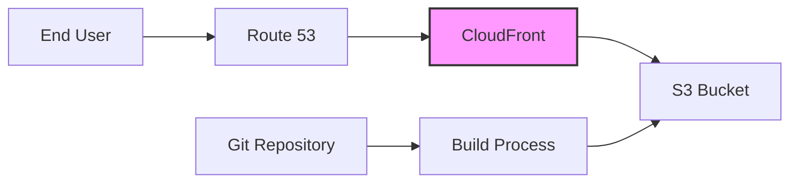

# Alternative Deployment: S3 + CloudFront

This document describes an alternative deployment architecture using S3 and CloudFront for hosting the Hugo site.

## Architecture



## Components

- **S3 Bucket**: Static website hosting
- **CloudFront**: Content delivery network
- **Route 53**: DNS management
- **Build Process**: Local Hugo build with deployment script

## Prerequisites

1. AWS Account with:

   - S3 bucket for static hosting
   - CloudFront distribution
   - Route 53 hosted zone
   - IAM user with appropriate permissions

2. Required Tools:
   - AWS CLI configured with appropriate credentials
   - Hugo Extended
   - Git
   - ImageMagick (optional, for image optimization)

## Deployment Process

### Initial Setup

1. Create S3 Bucket:

```bash
aws s3 mb s3://your-bucket-name
aws s3 website s3://your-bucket-name --index-document index.html --error-document 404.html
```

2. Create CloudFront Distribution:

   - Origin: Your S3 bucket
   - Default root object: index.html
   - Price class: Use all edge locations
   - SSL certificate: Custom SSL or ACM certificate

3. Configure Route 53:
   - Create A record
   - Alias to CloudFront distribution

### Deployment Script

```bash
#!/bin/bash
# deploy.sh

# Exit on error
set -e

# Colors for output
RED='\033[0;31m'
GREEN='\033[0;32m'
YELLOW='\033[1;33m'
NC='\033[0m'

print_status() {
    echo -e "${GREEN}[DEPLOY]${NC} $1"
}

print_error() {
    echo -e "${RED}[ERROR]${NC} $1"
}

print_warning() {
    echo -e "${YELLOW}[WARNING]${NC} $1"
}

# Build site
print_status "Building site..."
hugo --minify

# Sync with S3
print_status "Syncing with S3..."
aws s3 sync public/ s3://your-bucket-name/ --delete

# Invalidate CloudFront
print_status "Creating CloudFront invalidation..."
aws cloudfront create-invalidation \
    --distribution-id YOUR_DISTRIBUTION_ID \
    --paths "/*"

print_status "Deployment completed!"
```

### Usage

1. Configure the script:

   - Replace `your-bucket-name` with your S3 bucket name
   - Replace `YOUR_DISTRIBUTION_ID` with your CloudFront distribution ID

2. Make the script executable:

```bash
chmod +x deploy.sh
```

3. Deploy:

```bash
./deploy.sh
```

## IAM Policies

### Minimal S3 Policy

```json
{
  "Version": "2012-10-17",
  "Statement": [
    {
      "Effect": "Allow",
      "Action": [
        "s3:PutObject",
        "s3:GetObject",
        "s3:DeleteObject",
        "s3:ListBucket"
      ],
      "Resource": [
        "arn:aws:s3:::your-bucket-name",
        "arn:aws:s3:::your-bucket-name/*"
      ]
    }
  ]
}
```

### Minimal CloudFront Policy

```json
{
  "Version": "2012-10-17",
  "Statement": [
    {
      "Effect": "Allow",
      "Action": [
        "cloudfront:CreateInvalidation",
        "cloudfront:GetInvalidation",
        "cloudfront:ListInvalidations"
      ],
      "Resource": "arn:aws:cloudfront::YOUR_ACCOUNT_ID:distribution/YOUR_DISTRIBUTION_ID"
    }
  ]
}
```

## Advantages

- Complete control over CDN configuration
- Direct access to S3 for content management
- Flexible caching strategies
- Potential cost savings for high-traffic sites

## Disadvantages

- More complex setup
- Manual configuration required
- Higher maintenance overhead
- No built-in CI/CD

## Troubleshooting

1. S3 Access Issues:

   - Verify bucket policy
   - Check IAM permissions
   - Ensure bucket name matches configuration

2. CloudFront Issues:

   - Check distribution status
   - Verify origin settings
   - Review cache behaviors

3. Route 53 Issues:
   - Verify A record configuration
   - Check DNS propagation
   - Confirm SSL certificate status
